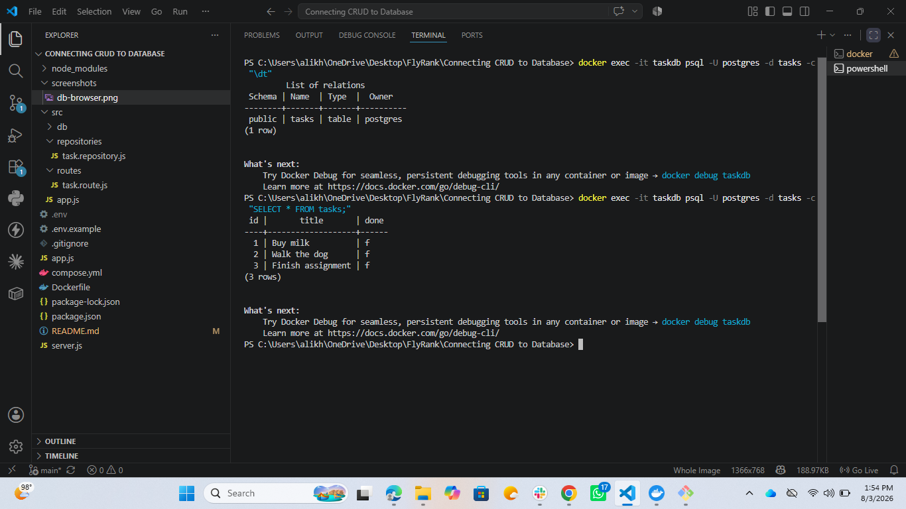

# Task + Auth API — Secured with Supabase

A task management REST API secured with **Supabase Auth**. Users sign up, log in, and receive a JSON Web Token (JWT) that guards access to protected routes. Both the app and a PostgreSQL database run in Docker containers, started together with a single command.

This project builds on a prior CRUD API (in-memory → SQLite → PostgreSQL) by adding a full authentication layer: signup, login, logout, JWT verification middleware, and interactive Swagger documentation with bearer-token support.

## What this is

An Express-based API where:
- Public data is open to anyone
- Task and profile data is only accessible to authenticated users
- Supabase handles all password hashing and token signing — this project never touches raw passwords or writes its own crypto

## Run it — one command

```bash
git clone https://github.com/<your-username>/<your-repo-name>.git
cd <your-repo-name>
cp .env.example .env
```

Then fill in your own Supabase credentials in `.env` (see below), and run:

```bash
docker compose up
```

The API will be available at `http://localhost:3000`. Interactive Swagger docs are at `http://localhost:3000/docs`.

## Environment variables

Copy `.env.example` to `.env` and fill in your own values:
Get `SUPABASE_URL` and `SUPABASE_KEY` (the **anon** key — never the `service_role` key) from your Supabase project under **Project Settings → API**.

## API Reference

| Method | Endpoint                  | Description                          | Auth required |
|--------|----------------------------|---------------------------------------|----------------|
| POST   | `/auth/signup`             | Create a new user account             | No             |
| POST   | `/auth/login`               | Log in and receive access/refresh tokens | No          |
| POST   | `/auth/logout`              | End the current session               | Yes (Bearer)   |
| GET    | `/public/info`              | Public, open data                     | No             |
| GET    | `/protected/profile`        | Get the logged-in user's profile      | Yes (Bearer)   |
| GET    | `/protected/dashboard`      | Protected welcome message             | Yes (Bearer)   |
| GET    | `/api/tasks`                | List all tasks                        | No             |
| GET    | `/api/tasks/:id`            | Get a single task by id               | No             |
| POST   | `/api/tasks`                | Create a new task                     | No             |
| PUT    | `/api/tasks/:id`            | Update a task's title/done            | No             |
| DELETE | `/api/tasks/:id`            | Delete a task                          | No             |

### Example: sign up, log in, and call a protected route

```bash
# 1. Sign up
curl -i -X POST http://localhost:3000/auth/signup \
  -H "Content-Type: application/json" \
  -d '{"email":"test@example.com","password":"password123"}'

# 2. Log in — copy the access_token from the response
curl -i -X POST http://localhost:3000/auth/login \
  -H "Content-Type: application/json" \
  -d '{"email":"test@example.com","password":"password123"}'

# 3. Call a protected route with the token
curl -i http://localhost:3000/protected/profile \
  -H "Authorization: Bearer <PASTE_YOUR_ACCESS_TOKEN>"
```

A missing or invalid token returns `401 Unauthorized`.

## Authentication flow

1. Client sends `email`/`password` to `/auth/signup` or `/auth/login`.
2. Supabase verifies credentials and returns a signed JWT (`access_token`).
3. Client attaches that token to protected requests as `Authorization: Bearer <token>`.
4. A reusable Express middleware (`requireAuth`) extracts the token, asks Supabase to verify it via `supabase.auth.getUser(token)`, and either attaches the verified user to the request or returns `401`.

This middleware is applied to every protected route (`/protected/profile`, `/protected/dashboard`, `/auth/logout`) — the verification logic is written once and reused.

## Swagger UI

Interactive API docs, including a bearer-token "Authorize" flow, are served at:
Protected routes show a lock icon. Click **Authorize**, paste a valid access token (no `Bearer` prefix — Swagger adds that), then use **Try it out** on any locked route.


## Database

On first run, the app automatically creates the `tasks` table and seeds three example tasks (only if the table is empty).

### Verifying the data

```bash
docker exec -it <container-name> psql -U postgres -d tasks -c "\dt"
docker exec -it <container-name> psql -U postgres -d tasks -c "SELECT * FROM tasks;"
```



## Persistence

Task data survives a full stack restart because it's stored in a Docker named volume (`taskdata`) rather than inside the container itself:

```bash
docker compose down
docker compose up
```

Tasks created before `down` are still present after `up`.

## Tech stack

- Node.js + Express
- Supabase Auth (Identity Provider)
- PostgreSQL 16 (Docker)
- Docker Compose
- `pg` (node-postgres) driver
- `swagger-jsdoc` + `swagger-ui-express`