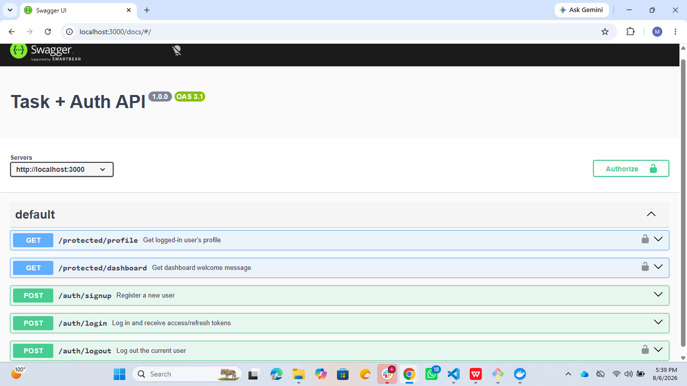
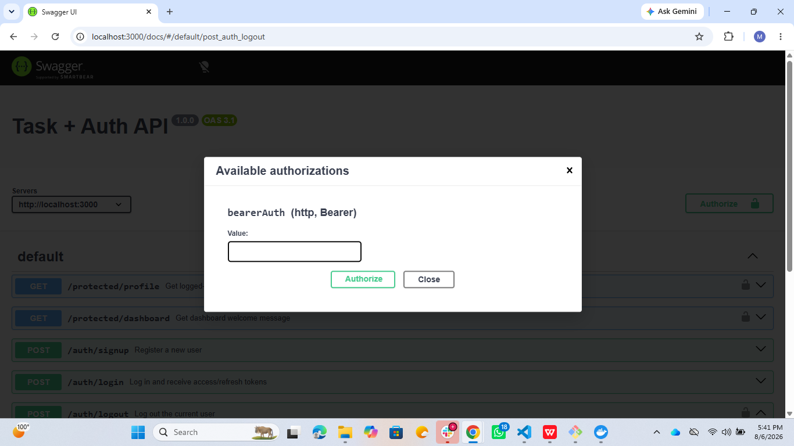

Protected routes show a lock icon. Click **Authorize**, paste a valid access token (no `Bearer` prefix — Swagger adds that), then use **Try it out** on any locked route.



## Database

On first run, the app automatically creates the `tasks` table and seeds three example tasks (only if the table is empty).

### Verifying the data

```bash
docker exec -it <container-name> psql -U postgres -d tasks -c "\dt"
docker exec -it <container-name> psql -U postgres -d tasks -c "SELECT * FROM tasks;"
```





## Persistence

Task data survives a full stack restart because it's stored in a Docker named volume (`taskdata`) rather than inside the container itself:

```bash
docker compose down
docker compose up
```

Tasks created before `down` are still present after `up`.

## Tech stack

- Node.js + Express
- Supabase Auth (Identity Provider)
- PostgreSQL 16 (Docker)
- Docker Compose
- `pg` (node-postgres) driver
- `swagger-jsdoc` + `swagger-ui-express`