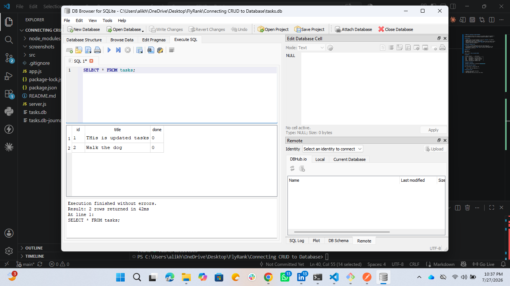

# CRUD API — Connected to SQLite Database

A task management REST API that started as an in-memory CRUD API (Assignment 1) 
and now persists all data to a real SQLite database (Assignment 2, Week 3).

## Why SQLite?

- **Single file** — the entire database is one file (`tasks.db`). No separate 
  database server to install, configure, or run.
- **Zero setup** — Node's built-in `node:sqlite` module ships with Node.js itself.
- **Survives restarts** — data written to `tasks.db` lives on disk, unlike the 
  in-memory array from Assignment 1.

## Where the database lives

- `tasks.db` is created automatically the first time the app runs.
- It's git-ignored, so every fresh clone starts with no database file — the 
  app creates it, creates the `tasks` table, and seeds three example tasks 
  automatically on first run.

## How to run

npm install
node server.js

Server runs on `http://localhost:3000`.

## Endpoints

| Method | Endpoint       | Description         |
|--------|----------------|----------------------|
| GET    | /api/tasks     | List all tasks       |
| GET    | /api/tasks/:id | Get one task by id   |
| POST   | /api/tasks     | Create a new task    |
| PUT    | /api/tasks/:id | Update a task        |
| DELETE | /api/tasks/:id | Delete a task        |

## Database screenshot

## Example SQL query (Stage 4)

Ran in DB Browser's "Execute SQL" tab:

    SELECT * FROM tasks WHERE done = 1;

## Persistence proof

1. Created a task via POST /api/tasks.
2. Restarted the server.
3. GET /api/tasks — the new task was still there.